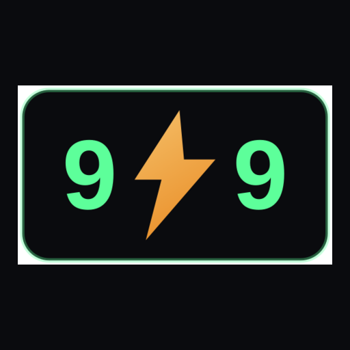
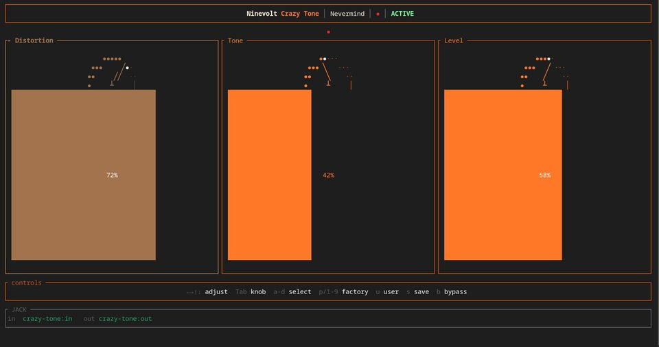
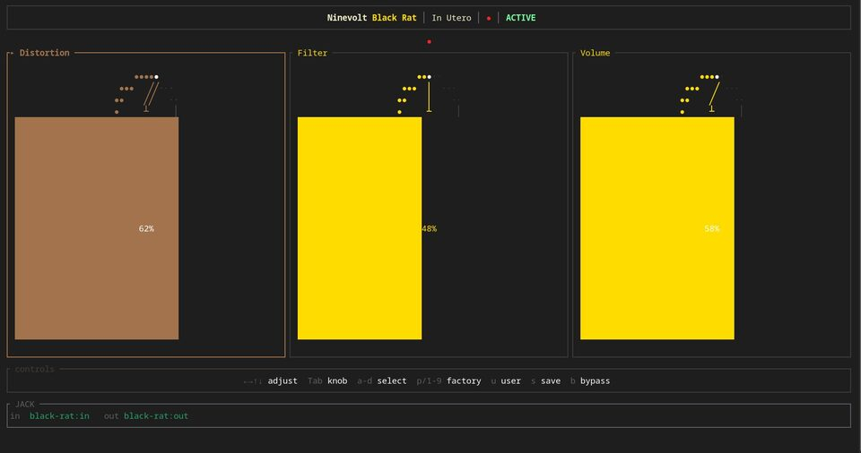
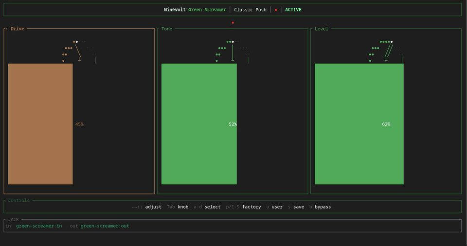
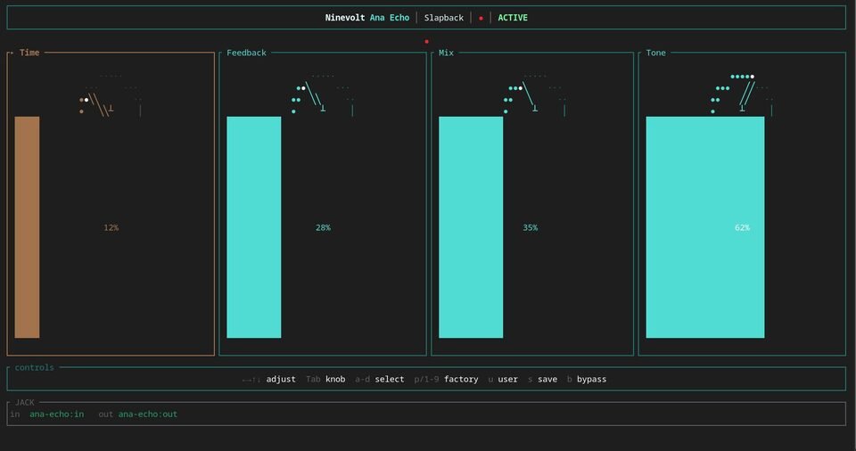
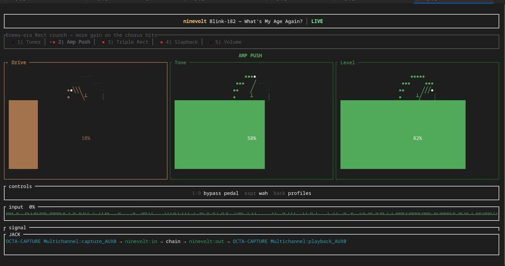

<p align="center">
  
</p>

<h1 align="center">NineVoltNine</h1>

<p align="center">
  <strong>Terminal guitar pedals for Linux.</strong>
</p>

<p align="center">
  <a href="https://ninevoltnine.com"></a>
  <a href="https://ninevoltnine.com/install.html"></a>
  <a href="mailto:jon@ninevoltnine.com"></a>
  
</p>

NineVoltNine builds **Ninevolt** — real-time guitar effects that treat the terminal like a pedalboard: JACK in, JACK out, knobs in a TUI, and whole boards as YAML you can share and version.

```bash
# Fedora
sudo dnf install https://ninevoltnine.com/downloads/repo.rpm
sudo dnf install ninevolt

# Debian / Ubuntu
curl -fsSL -o /tmp/ninevolt-repo.deb https://ninevoltnine.com/downloads/repo.deb
sudo apt install /tmp/ninevolt-repo.deb && sudo apt update && sudo apt install ninevolt
```

---

### Pedals with faces

Every stomp has a TUI you can read from across the room.

<p align="center">
  <a href="https://ninevoltnine.com/pedals/crazy-tone.html"></a>
  <a href="https://ninevoltnine.com/pedals/black-rat.html"></a>
</p>
<p align="center">
  <a href="https://ninevoltnine.com/pedals/green-screamer.html"></a>
  <a href="https://ninevoltnine.com/pedals/ana-echo.html"></a>
</p>

<p align="center">
  
  <br />
  <sub>LIVE chain — Amp Push on a Blink-inspired board</sub>
</p>

<p align="center">
  <a href="https://ninevoltnine.com/pedals/">Browse the full library →</a>
</p>

---

### What we build

| | |
|---|---|
| **Ninevolt** | Linux package of guitar pedals over JACK (or PipeWire’s JACK bridge) |
| **Pedals with faces** | Every stomp has a TUI you can read from across the room |
| **Chains & profiles** | YAML boards you can edit, diff, and hand to a friend or an agent |
| **Local-first** | No license server, no account gate — play offline, including on a tour spare |

Built for the desk and the stage. Feature requests and bugs: [jon@ninevoltnine.com](mailto:jon@ninevoltnine.com).
